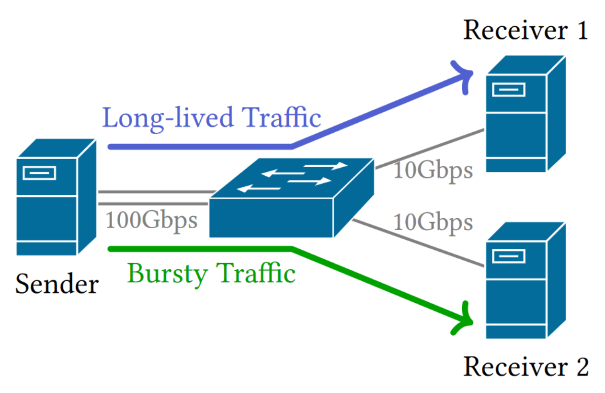

# P4 Experiments
## Description

Scripts to perform the P4 experiments, which show the ability of absorbing traffic bursts.

## Content

- Run in switch
    - `bfshell.sh`: script to run bfshell
    - `env.sh`: script to load the driver
    - `make.sh`: script to make p4 program
    - `run.sh`: script to run p4 program
    - `init.sh`: script to config the control plane
    - `init.py`: switch config used by `init.sh`
- Run in server
    - `send_sync_packet.py`: script to send the first sync packet
    - `pcap2csv.py`: script to process the data to csv we get from pcap of mirrored sync packets
    - `plot.py`: script to draw plot from the csv above

## Aritfact Evaluation README

### Environment Setup

- An Edgecore Wedge100BF-32X switch (with Tofino programmable switch ASIC).
    - The download and installation of P4 Studio Software Development Environment (SDE) is documented in a Intel Confidential guide. Join Intel® Connectivity Research Program's (ICRP) to get access.
    - After the installation, clone the `eurosys25-artifacts` branch of this repository (https://github.com/ants-xjtu/Occamy.git). Modify the installation path (`export SDE=/root/bf-sde-9.9.0`) in `env.sh` (if different).

- One sender and two receivers connected to the switch. Each server has a 16-core 2.10GHz x86 CPU and 16GB memory. The sender is equipped with a dualport 100GbE NIC, connected to the switch with two 100Gbps links. Each receiver is equipped with an 10GbE NIC, connected to the switch with a 10Gbps link. 
    - Link up the switch and the servers, and set the links up in the switch.
        - Find out the port number of the links. You can find infomation in Section 12 of [this document](https://github.com/barefootnetworks/Open-Tofino/blob/master/PUBLIC_Tofino-Native-Arch.pdf) by Intel.
        - (Optional) We recommend you to use ports from the same pipeline for possibly stability.
        - Run `ucli` then `pm` and `show` the ports in the console of `bf_switchd`, to ensure all links are up.
    - The testing program is `pktgen`, a DPDK application, which deploys on all the servers. Setup according to [the official document](https://pktgen-dpdk.readthedocs.io/en/latest/getting_started.html). Deploy `pktgen` in sender and receiver 1.
        - Before building `pktgen`, edit `pktgen-dpdk/app/pktgen-capture.c` and modify to `#define CAPTURE_BUFF_SIZE (1024 * (1024 * 1024))` instead of 4M.
    - Install `scapy` in receiver 2.
    - We set the sender's ip as `192.168.3.11` and `192.168.3.12`, while the receiver 1's ip as `192.168.3.21` and the receiver 2's ip as `192.168.3.22`. `192.168.3.11` send bursty traffic to receiver 1, while `192.168.3.12` send long-lived traffic to receiver 2.

- Edit `init.py`, which specifies the links, the flow table, the definition of all queues and the synchronization action.
    - Modify the `DEV_PORT` numbers of the 2 10G ports and the 2 100G ports used in last step.
        - `myport.add(DEV_PORT=156, SPEED="BF_SPEED_10G", ...)`
    - Modify the `port`s in the flow table to match the IP and the ports.
        - `ipv4_lpm.add_with_send(dst_addr=ip_address('192.168.3.11'),dst_addr_p_length=32,port=188)`
    - Specify the queues that we concern. In the experiments, `q1` and `q3` are used for the two kinds of traffic. Modify the ports and the sync pipe accordingly. See the comments.
    - Modify where sync packets mirror. In the experiments, we capture sync packets in sender `192.168.3.11`.

### Run the Experiments

- In the switch, enter `Occamy/exp/p4/`.
    - To run the switch, use `run.py`:
        - `./run.py <alpha> [--dt]`
        - For example, if we want Fig. 22 (b), which uses Occamy with α = 4, `./run.py 4`; if we want Fig. 22 (c), which uses DT with α = 1, `./run.py 1 --dt`.
    - Run `init.sh`. Make sure `init.py` modified correctly.
        - `bfshell.sh` can be used to config more.

- In receiver 2, enter `Occamy/exp/p4/`.
    - Modify the interface in `sendp(packet, iface="enp4s0f1")` to that connecting to the switch.
    - Run `./send_sync_packet.py` to send the initial sync packet. Sync packets would be mirrored to the port we set from now on.

- In sender, start sending long-lived traffic to receiver 2 in `pktgen`.

### Reproduce Figure 22

#### Procedure

- Start tests below.
    - While the modified `pktgen` running, use `enable <port> capture` and `disable <port> capture` in the `pktgen` command line to collect sync packets. `<port>` is the port where sync packets are mirrored.
    - We mostly concern about the queue lengths and threshold when the burst traffic happens. After start capturing, use `start <port>` in `pktgen` to send burst traffic.

- `pcap` file would be generated in the directory where `pktgen` were started.
    - After that, use `./pcap2csv.py <pcap_file_basename>` to generate `<pcap_file_basename>.csv`.
    - Use `./plot.py <pcap_file_basename>` to draw the queue length plot (with a graphic desktop).
    - 1 cell can contain 80 bytes.

#### Figure 22 (a)

- Run the switch with `./run.py 1`.
- Start capture, send burst traffic, and stop capture. Then use the data to draw the plot as above.

#### Figure 22 (b)

- Run the switch with `./run.py 4`.
- Start capture, send burst traffic, and stop capture. Then use the data to draw the plot as above.

#### Figure 22 (c)

- Run the switch with `./run.py 1 --dt`.
- Start capture, send burst traffic, and stop capture. Then use the data to draw the plot as above.

#### Figure 22 (d)

- Run the switch with `./run.py 1 --dt`.
- Start capture, send burst traffic, and stop capture. Then use the data to draw the plot as above.

### Reproduce Figure 23

#### Procedure

- Start tests below. We change the burst size, and see how many percents of it could get its destination successfully.
    - Use `set <port> count <pktnum>` to change burst size.
    - See the stats in the receiver's `pktgen`, and record the number of reached packets.
    - Use the fomula to calculate loss rate:
        - lost_rate = (sent_packet_number - reached_packet_number) / sent_packet_number
    - Draw the plot.

#### Figure 23 (b)

- Run the switch with `./run.py 1`.
- Start testing while changing burst size. Record the statistics and draw the plot. You get the red line (Occamy).
- Run the switch with `./run.py 1 --dt`.
- Start testing while changing burst size. Record the statistics and draw the plot. You get the green line (DT).

#### Figure 23 (c)

- Run the switch with `./run.py 2`.
- Start testing while changing burst size. Record the statistics and draw the plot. You get the red line (Occamy).
- Run the switch with `./run.py 2 --dt`.
- Start testing while changing burst size. Record the statistics and draw the plot. You get the green line (DT).

#### Figure 23 (d)

- Run the switch with `./run.py 4`.
- Start testing while changing burst size. Record the statistics and draw the plot. You get the red line (Occamy).
- Run the switch with `./run.py 4 --dt`.
- Start testing while changing burst size. Record the statistics and draw the plot. You get the green line (DT).

### Reproduce Table 2

After making the switch (e.g. `./make.py 4`), you can see the data in the directory of the SDE. (`bf-sde-<version>/p4studio/occamy/tofino/pipe/logs`)